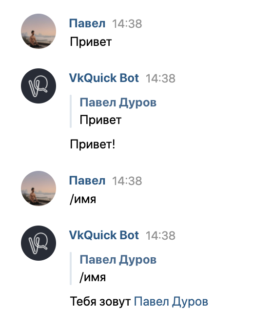

__НА ДАННЫЙ МОМЕНТ ПРОДУКТ ВЕРСИИ 1.0 В РАЗРАБОТКЕ, ВСЯ ИНФОРМАЦИЯ НИЖЕ ЕЩЕ НЕ АКТУАЛЬНА. ПОДДЕРЖКИ 0.2 БОЛЬШЕ НЕТ, НО ВЫ ВСЕ ЕЩЕ МОЖЕТЕ УСТАНОВИТЬ ЕЕ С PYPI, НАЙТИ ДОКУМЕНТАЦИЮ НА [https://vkquick.github.io](https://vkquick.github.io) И ИСХОДНЫЙ КОД В ВЕТКЕ 0.2__
***
# VK Quick

[](https://pepy.tech/project/vkquick)

__VK Quick — это современный асинхронный фреймворк для создания ботов ВКонтакте__

* [__Официальное сообщество в ВКонтакте__](https://vk.com/vkquick)

* [__Официальная беседа, где отвят на любой вопрос по API и разработке ботов__](https://vk.me/join/AJQ1dzLqwBeU7O0H_oJZYNjD)

* [__Официальный сайт с документацией__](https://vkquick.rtfd.io)

***

## Ключевые особенности:

* __Скорость__: VK Quick использует конкурентность в одном потоке (asyncio) и является одним из самых быстрых фреймворков для разработки ботов

* __Компактность кода__: Разработка требует меньше времени в несколько раз, код становится короче, вероятность возникновения багов уменьшается. VK Quick _автоматически_ создает документацию к написанному боту, позволяя сконцентрироваться разработчику именно на самом коде

* __Легкое обучение__: Создавать ботов невероятно просто вместе с VK Quick! Обучение проходит быстро и легко

* __Инструменты для упрощения разработки__: Из коробки VK Quick представляет CLI (терминальная утилита) — инструмент, облегающий процесс создания команд, настройки проекта и выстраивания архитектуры

* __Поддержка актуального API__: Множество разных возможностей для ботов перенесены в удобный Python-стиль, любые нововведения в социальной сети незамедлительно отображаются в самом фреймворке

* __Отзывчивое коммьюнити__: Вы всегда можете обратиться с вопросом, на который обязательно ответят наши специалисты по разработке ботов в официальной беседе нашего сообщества

***

## Установка
```shell script
python -m pip install vkquick
```

> До релиза 1.0: `python -m pip install https://github.com/deknowny/vkquick/archive/master.zip`

***

Вместе с фреймворком устанавливается треминальная утилита — `kwik`:

```shell script
kwik --help
```

***

# Echo-бот
Прежде чем создать своего первого бота, нужно получить специальный __токен__ — ключ, через который можно взаимодействовать с ресурсами ВК (получать сообщения, отправлять их...). VK Quick позволяет писать ботов для групп и пользователей в одном стиле — достаточно запустить код с нужным токеном

Для примера напишем бота с двумя командами:
1. Бот отвечает `Привет!` на сообщение с текстом `echo` или `привет` (регистр символов не важен)
2. Бот пришлет имя пользователя/группы, вызвавшего команду

```python
import vkquick as vq


app = vq.App()


@app.command("echo", "привет")
async def greeting():
    return "Привет!"


@app.command("имя", prefixes={"/"})
async def get_name(ctx: vq.NewMessage):
    sender = await ctx.fetch_sender(vq.User)
    return f"Тебя зовут {sender:@<fullname>}"


# Сюда необходимо передать свой токен 
# от пользователя или группы
app.run("token")
```
Запускаем файл и идем к боту в личные сообщения!



Хотите больше? Переходите на наш официальный сайт [https://vkquick.rtfd.io](https://vkquick.rtfd.io) и продолжайте углубляться в разработку ботов вместе с VK Quick!
