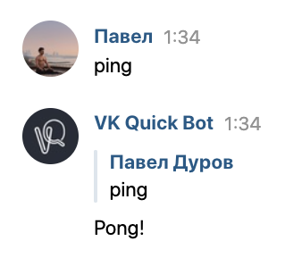

# Имена и префиксы
Под выражением "чат-бот" подразумевают группу, от лица которой работает бот, имеющий определенный набор команд. Грамотная семантика, чтобы пользоваться командами бота было максимально удобно, строится следующим образом:

```
{PREFIX}{NAME} {ARG1} {ARG2} ...
```

Где:

* `PREFIX`: Префикс перед командой. Необходим, чтобы команды бота не конфликтовали с обычными сообщениями или командами других ботов. Иногда в качестве префикса выбирают целое имя, например, `кай ` или `ада `. В таком случае префикс может стать отличительной чертой бота, по которому его легко узнают
* `NAMES`: Имя команды. Тут все более чем очевидно: имя команды определяет то, какой функционал бота задействуется. Имя команды может состоять из нескольких слов, но единственное, стоит не забывать, что чем проще пользователю вызвать команду, набрав текст на клавиатуре своего смартфона — тем же лучше. О том, как создать удобного по использованию чат-бота будет написана отдельная страница. Команда идет вполтную к префиксу (без пробелов)
* `ARG1/2/3`: Аргументы команды. Логика у них такая же, как и у аргументов функции: параметризировать вызов команды. Перечисляемые аргументы отеделяются от имени и друг от друга пробельными символами (пробел или абзац)

Получается что-то подобное

```
/погода Москва
```

Где `/` — префикс, `погода` — имя команды, а `Москва` — аргумент

> Префиксов, как и имен, может быть несколько. Например, имя команды на русском и английском, или же какое-то сокращение. А может и не быть вовсе. О ситуациях, когда у команды не должно быть ни префикса, ни имени, мы поговорим позже

***

В этой главе мы разберем, как создавать команды с разными именами и префиксами


# Имена команды
Создадим пинг-понг команду: мы пишем боту `ping`, а он отвечает нам `Pong!`. Для этого необходимо сделать _объект_ класса `App`, который в последующем использовать в декораторах, таким образом добавляя возможные команды в бота

``` { .py }
--8<-- "docs/src/names-and-prefixes/code/ping.py"
```

??? tip "Пример работы"
    

То есть для того, чтобы создать команду, реагирующую на `ping`, необходимо повесить декоратор на корутинную функцию (`#!python async def`) и указать соответствующее имя команды

***

## Несколько имён
Если же команде нужно задать несколько имён, на которые она должна реагировать, то их достаточно просто перечислить через запятую в декораторе:

``` { .py  hl_lines="7" } 
--8<-- "docs/src/names-and-prefixes/code/many-names-ping.py"
```

??? tip "Пример работы"
    -- todo

***

# Префиксы
Помимо имени команде в декораторе можно обозначить и префиксы следующим образом

``` { .py hl_lines="7" }
--8<-- "docs/src/names-and-prefixes/code/prefix.py"
```

??? tip "Пример работы"
    -- todo

Перечисляя префиксы в списке вы указываете все возможные префиксы для этой команды. VK Quick сначала проверяет команду на всевозможные префиксы, с которыми команда совместима, а затем со всевозможными именами
***
## Префиксы для нескольких команд
Представим случай, что в вашем боте очень много команд с одинаковым префиксом. Повторять один и тот же код везде -- не лучшая практика, поэтому префиксы можно указать __сразу__ при инициализации `App`

``` { .py hl_lines="4" }
--8<-- "docs/src/names-and-prefixes/code/prefix-in-app.py"
```
??? tip "Пример работы"
    -- todo

Теперь указанные в `App` префиксы будут распространяться на все перечисленные команды

!!! note
    Представим ещё один случай: у вас много команд, но одна из них должна иметь свой собственный префикс, отличающийся от префиксов других команд. В таком случае необходимо указать префикс для других команд в том же `App`, а для этой особенной команды указать ее личные префиксы в самом декораторе. Префиксы никак не суммируется, поэтому если и у команды, и у `App` был обозначен префикс, то команда будет реагировать только на тот префикс, который указан в её декораторе
***
# Команды, чувствительные к регистру символов
Вы могли заметить, что по умолчанию команды регистронезависимы, т.е. команда с именем `ping` будет реагировать как на `ping`, так и на `Ping`, и на `pINg` и все в таком стиле. Чтобы включить чувствительность к регистру, передайте следующий параметр в декоратор

``` { .py hl_lines="7" }
--8<-- "docs/src/names-and-prefixes/code/sensitive-command.py"
```
??? tip "Пример работы"
    -- todo

VK Quick использует регулярные выражения. Паттерны регулярных выражений принимают битовую маску различных флагов. По умолчанию для команд используется флаг `re.IGNORECASE`, как раз-таки и означающий регистронезависимость символов. `0` для регулярных шаблонов означает отсутствие флагов. Вы можете передать необходимые флаги регулярных выражений через битовое "или"
