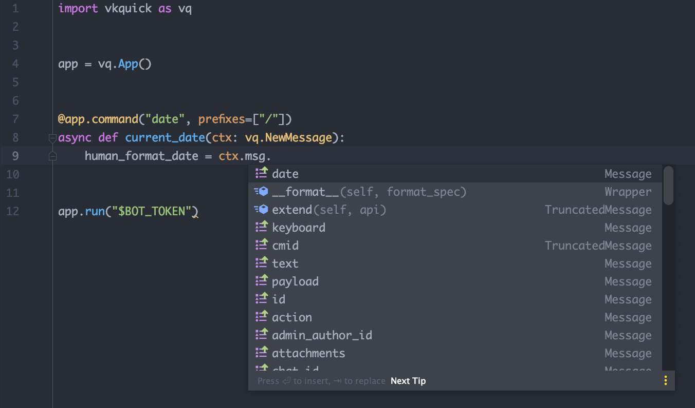
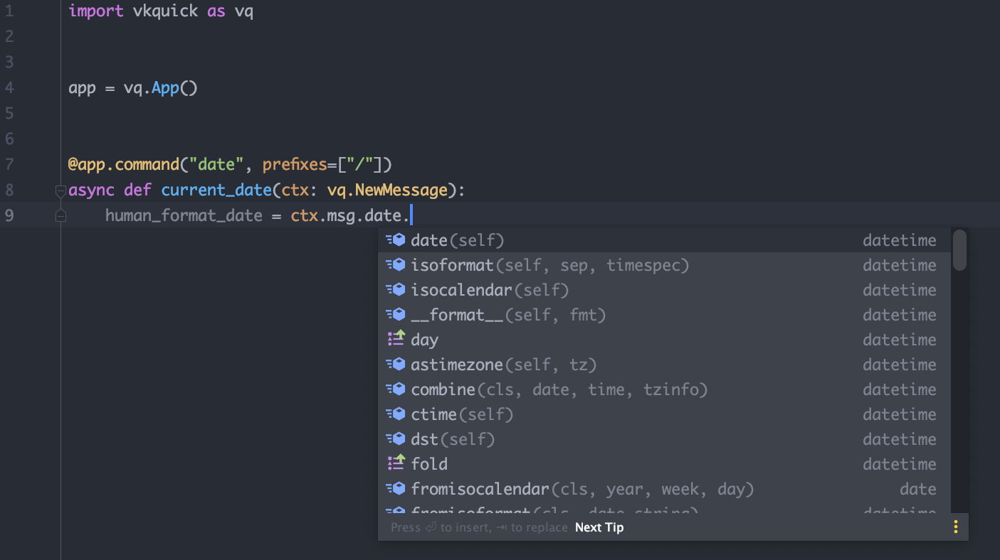

# Поля сообщения

Поля сообщения можно получить через `#!python ctx.msg.{имя поля}`. Полный список полей можно найти на [странице официальной документации](https://vk.com/dev/objects/message)

Сами поля типизированы, поэтому если вы используете современные редакторы кода, то вы увидите подсказки



***
Пример использования поля `date` (автоматическая конвертация в `datetime.datetime`)

``` { .py }
--8<-- "docs/src/new-message-context/message-fields/code/current_date.py"
```

??? tip "Пример работы"
    -- todo


!!! tip
    Если поле опционально и может как присутствовать в сообщении, так и отсутствовать, оно будет помечено как `#!python typing.Optional[тип]`


!!! note
    Объект приходящего сообщения -- это лишь кусочек всего события. Чтобы получить поля "сырого" события, используйте `ctx.event.{поле}`. Подробнее о полях события написано в {later}